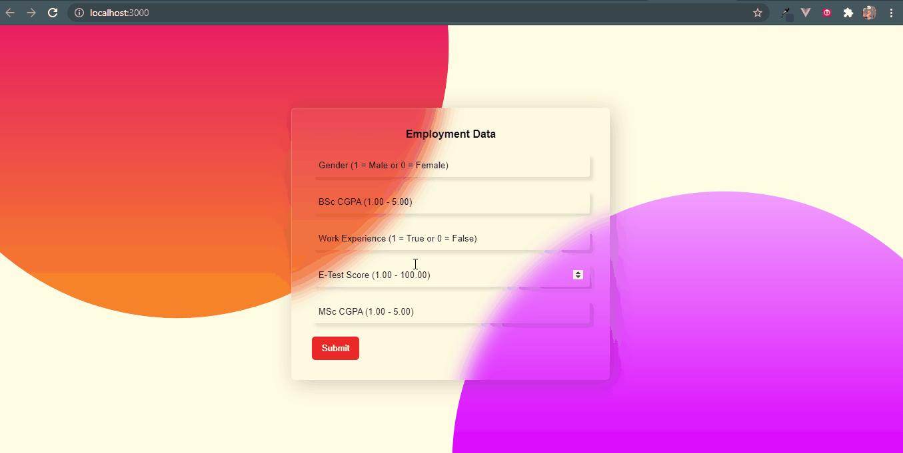
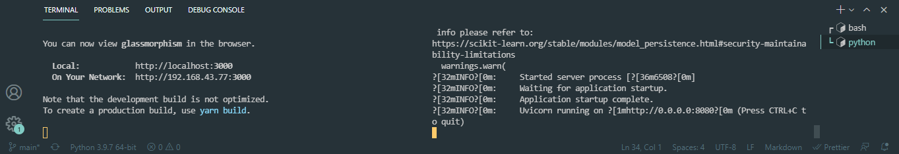
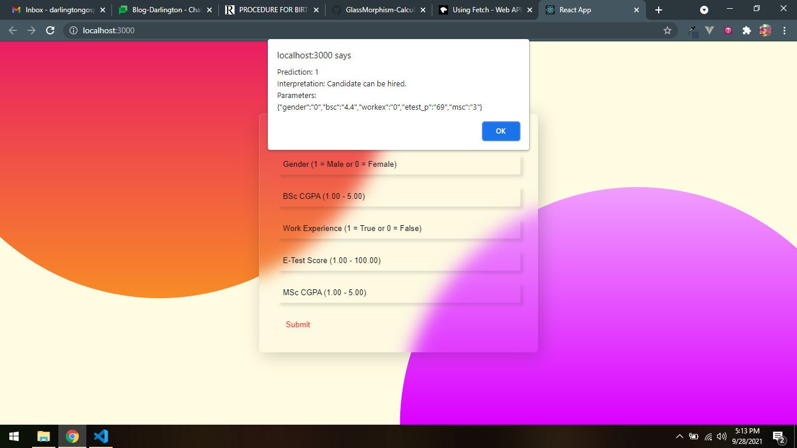

# How to Build a Predictive Site With React and Python (Part Three: Web Development)

Read the full tutorial here: [**>> How to Build a Predictive Site With React and Python (Part Three: Web Development)**](https://daltonic.github.io)

This example shows How to Build a Predictive Site With React and Python (Part Three: Web Development):


<center><figcaption>Web UI Developed</figcaption></center>

## Technology

This demo uses:

- React
- Axios
- Glassmorphism (CSS)

## Running the demo

To run the demo follow these steps:

1. Clone the github project on the terminal ``` git clone https://github.com/Daltonic/predictive.git ```.
2. Open the project in VSCode.
3. Open new terminal and run the following commands.
    ```sh
    yarn install
    yarn start
    ```
4. Open another terminal and run the following commands.
    ```sh
    cd api
    python main.py
    ```


<center><figcaption>Terminal Process View</figcaption></center>
<br/>

5. Visit the **localhost:3000** on your browser.

<center><figcaption>React Glassmorphism Based Interface</figcaption></center>
<br/>

<br/>

Questions about running the demo? [Open an issue](https://github.com/Daltonic/slack-clone/issues). We're here to help ✌️

## Useful links

- 🏠 [Website](https://daltonic.github.io/)
- 🔥 [React](https://reactjs.org/)
