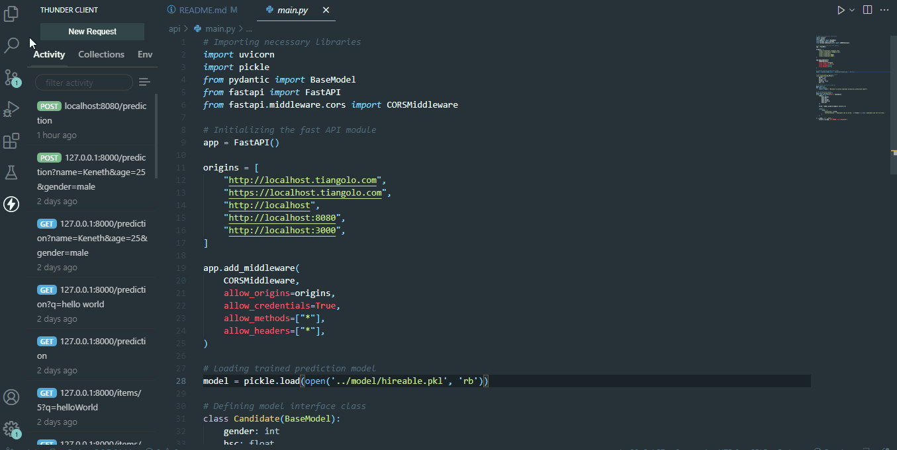
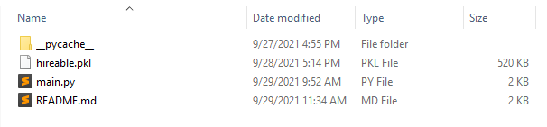
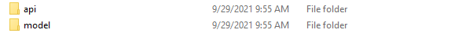
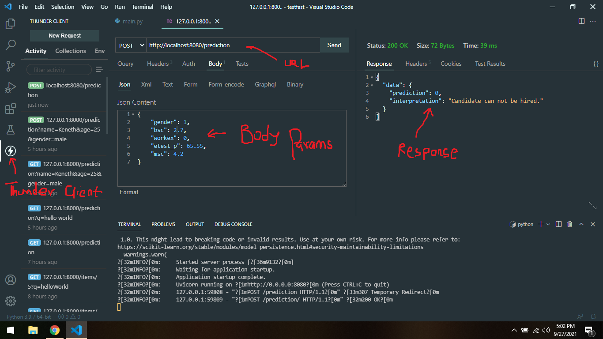

# How to Build a Predictive Machine Learning Site With React and Python (Part Two: API Development)

Read the full tutorial here: [**>> How to Build a Predictive Machine Learning Site With React and Python (Part Two: API Development)**](https://daltonic.github.io)

This example shows How to Build a Predictive Machine Learning Site With React and Python (Part Two: API Development):


<center><figcaption>API Developed In VSCode</figcaption></center>

## Technology

This demo uses:

- Python 3.9.7
- Fastapi 0.68.1
- Uvicorn 0.15.0
- Scikit-learn 1.0
- Thunder Client

## Running the demo

To run the demo follow these steps:

1. Visit [https://downgit.github.io/](https://downgit.github.io/). 
2. Paste ```https://github.com/Daltonic/predictive/tree/main/api``` in the field thereon and click on the download button.
3. Unzip **api.zip** and place contents on a unique folder. You should have something like this.


<center><figcaption>API File Structure</figcaption></center>
<br/>

4. Place the **api** folder *side-by-side* with the **model** folder. It should look like this.

<center><figcaption>Project Structure</figcaption></center>
<br/>

5. Open the **api** folder in VSCode.
6. Head to Python's Website and download version 3.9.7 or later for your operating system.
7. Install the Python compiller in your computer and add path to variables.
8. Install the following packages.
```bash
    pip install fastapi
    pip install uvicorn[standard]
    pip install scikit-learn
```
8. Run ``` python main.py ``` on the terminal.
9. Install the VSCode Thunder Client extension.
10. Open the Thunder Client extension and enter the below parameters as shown in the image below.
<br/>


<center><figcaption>VSCode Thunder Client</figcaption></center>
<br/>

Questions about running the demo? [Open an issue](https://github.com/Daltonic/slack-clone/issues). We're here to help ✌️

## Useful links

- 🏠 [Website](https://daltonic.github.io/)
- 🔥 [Python](https://www.python.org/)
- 🔷 [Downgit](https://downgit.github.io/)
- 📚 [FastAPI](https://fastapi.tiangolo.com/)
