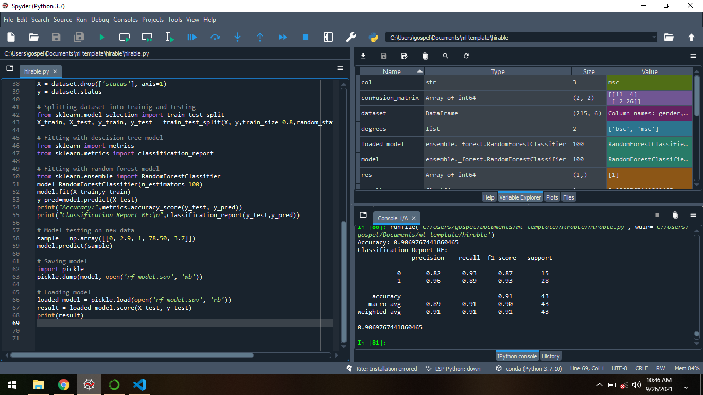
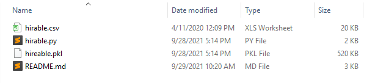
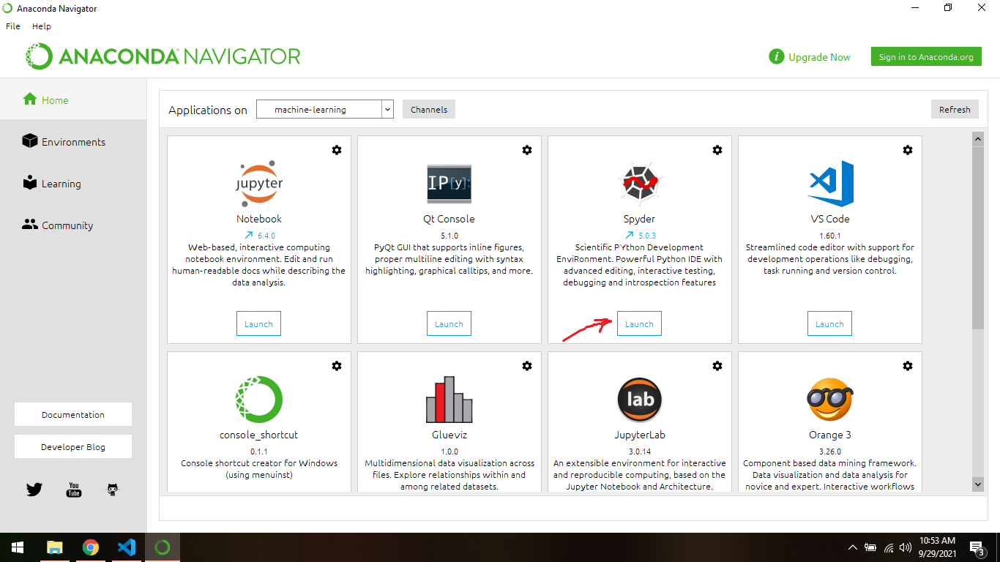
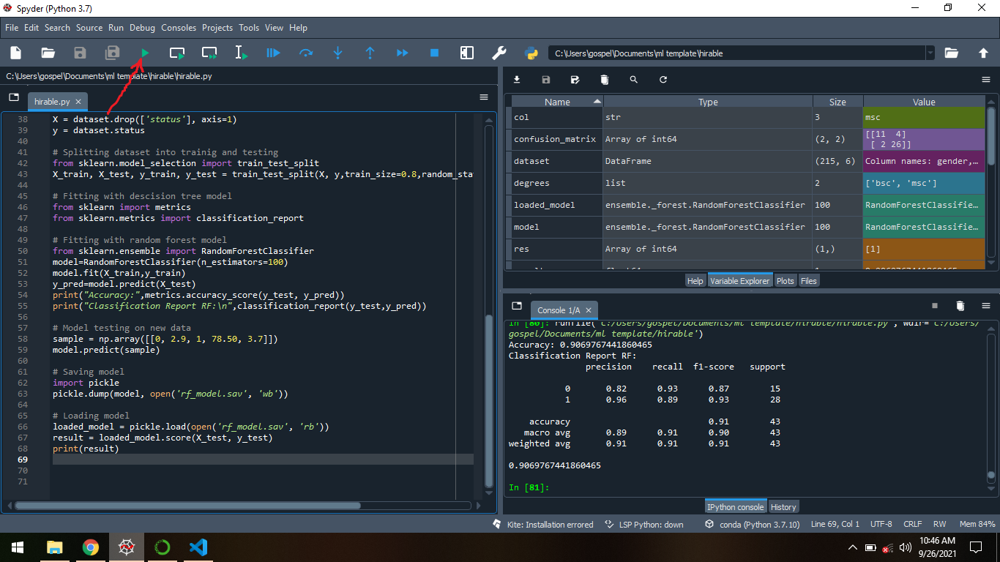

# How to Build a Predictive Machine Learning Site With React and Python (Part One: Model Development)

Read the full tutorial here: [**>> How to Build a Predictive Machine Learning Site With React and Python (Part One: Model Development)**](https://daltonic.github.io)

This example shows How to Build a Predictive Machine Learning Site With React and Python (Part One: Model Development):


<center><figcaption>Model Developed In Anaconda Spyder</figcaption></center>

## Technology

This demo uses:

- Anaconda 3
- Spyder 5.0.3

## Running the demo

To run the demo follow these steps:

1. Head to [Anaconda](https://www.anaconda.com/products/individual) Site
2. On the page download Anaconda for your operating system.
3. Install the Anaconda package to your computer.
4. Visit [https://downgit.github.io/](https://downgit.github.io/). 
5. Paste ```https://github.com/Daltonic/predictive/tree/main/model``` in the field thereon and click on the download button.
6. Unzip **model.zip** and place contents on a unique folder. You should have something like this.
<br/>


<center><figcaption>Model File Structure</figcaption></center>
<br/>

7. Open Anaconda Navigator and lunch spyder from the option.
<br/>


<center><figcaption>Anaconda Navigator</figcaption></center>
<br/>

8. Using *spyder* locate and open **hireable.py** in the unique folder you placed it.

9. Run the script using the green play button.
<br/>


<center><figcaption>Run Codes</figcaption></center>
<br/>

Questions about running the demo? [Open an issue](https://github.com/Daltonic/slack-clone/issues). We're here to help ✌️

## Useful links

- 🏠 [Website](https://daltonic.github.io/)
- 🔥 [Anaconda](https://www.anaconda.com/products/individual/)
- 🔷 [Downgit](https://downgit.github.io/)
